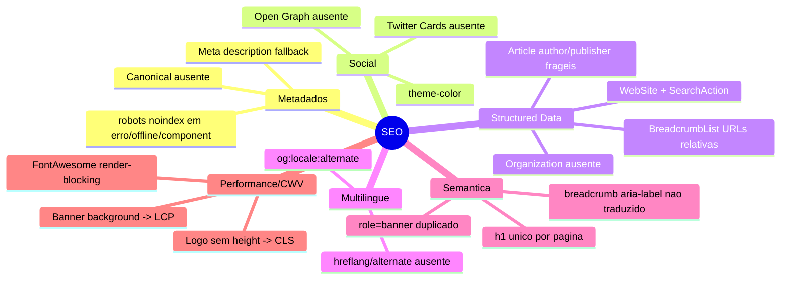
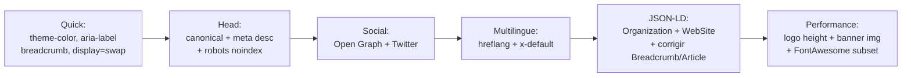

# Eixo 1 — SEO técnico

> Auditoria read-only de `tpl_generico/`. Severidade: **Alta / Média / Baixa**.
> O template já acerta vários pontos (ver "Conformes" no fim); as lacunas concentram-se
> em **metadados sociais/canônicos**, **sinalização multilíngue (hreflang)** e **schemas globais**.

## Visão do eixo



## Tabela de achados

| ID | Achado | Sev. | Arquivo:linha |
|----|--------|------|---------------|
| A1 | Sem `rel="canonical"` (conteúdo duplicado) | **Alta** | `index.php` head (207) |
| B1 | Sem Open Graph (apesar do FB Pixel ativo) | **Alta** | `index.php` |
| D1 | Sem `hreflang`/`alternate` (site de 8 idiomas) | **Alta** | `index.php` + `templateDetails.xml:50-67` |
| A2 | Sem fallback de meta description | Média | `index.php` |
| A3 | Sem `robots noindex` em erro/offline/component | Média | `error.php`, `offline.php`, `component.php` |
| B2 | Sem Twitter Cards | Média | `index.php` |
| C1 | Sem `Organization`/`WebSite`+SearchAction | Média | `index.php` |
| C2 | BreadcrumbList JSON-LD com URLs relativas | Média | `mod_breadcrumbs/default.php:29-34,49` |
| C3 | Article JSON-LD: `author`/`publisher`/`image` frágeis | Média | `com_content/article/default.php:44-79` |
| E1 | `h1` pode duplicar ou faltar | Média | `com_content/article/default.php:92,124,137` |
| F2 | Logo sem `height` → CLS | Média | `index.php:72` |
| F3 | Banner como `background-image` → piora LCP | Média | `mod_custom/banner.php:18-24` |
| G1 | `role="banner"` duplicado | Média | `index.php:216,280` |
| H1 | FontAwesome completo render-blocking | Média | `joomla.asset.json:44-48` |
| A4 | `offline.php` com `<title>` duplicado | Baixa | `offline.php:51-52` |
| C4 | JSON-LD: mecanismos inconsistentes (addScriptDeclaration vs addCustomTag) | Baixa | `mod_breadcrumbs/default.php:49` / `article/default.php:80` |
| E2 | Cards de módulo `h3` por padrão (salto de hierarquia) | Baixa | `chromes/card.php:26` |
| E3 | `lang` por bloco multilíngue ausente; BCP-47 | Baixa | `index.php:205` / `article/default.php:121` |
| F1 | Logo `alt`/`title` redundantes | Baixa | `index.php:72` |
| G2 | `role` redundantes em landmarks HTML5 | Baixa | `index.php:216,284,326` |
| G3 | Breadcrumb sem microdata inline | Baixa | `mod_breadcrumbs/default.php:23-45` |
| H2 | Google Font sem `display=swap` garantido | Baixa | `index.php:47-54` |
| H5 | GTM/Pixel inline no head | Baixa | `index.php:186-191` |
| I1 | Sem hint de sitemap/robots (documentação) | Baixa | — |
| I2 | Sem `theme-color`/manifest | Baixa | `index.php:24-32` |
| I3 | `apple-touch-icon` fixa `sizes=180x180` | Baixa | `index.php:31` |
| J2 | `aria-label="breadcrumb"` não traduzido | Baixa | `index.php:287` |
| K1 | Versão de assets desalinhada (cache-busting) | Baixa | `templateDetails.xml:4`, `joomla.asset.json:5` |

## Achados detalhados (Altas e Médias)

### A1 — Sem `rel="canonical"` · Alta · `index.php` head
O Joomla core não gera canonical no front-end. URLs com query string, paginação
(`?start=`), ordenação e múltiplos caminhos de categoria/tag geram duplicação sem sinal
canônico. Inserir antes do `<jdoc:include type="head" />`:

```php
$canonical = Uri::getInstance()->toString(['scheme', 'host', 'port', 'path']);
$this->addHeadLink($canonical, 'canonical');
// respeitar canonical já setado por com_content; ligar SEF + unicodeslugs.
```

### B1 — Sem Open Graph · Alta · `index.php`
Nenhuma tag `og:*`. Crítico porque o **Facebook Pixel já está ativo** (`index.php:189-190`)
— a intenção social existe, o OG não. Montar a partir dos metadados do documento:

```php
$this->setMetaData('og:site_name', $sitename, 'property');
$this->setMetaData('og:title', $this->getTitle(), 'property');
$this->setMetaData('og:type', ($option === 'com_content' && $view === 'article') ? 'article' : 'website', 'property');
$this->setMetaData('og:url', Uri::getInstance()->toString(['scheme','host','path']), 'property');
if ($desc = $this->getMetaData('description')) {
    $this->setMetaData('og:description', $desc, 'property');
}
if ($ogImg = $this->params->get('logoFile')) {
    $this->setMetaData('og:image', Uri::root() . $ogImg, 'property');
}
$this->setMetaData('og:locale', str_replace('-', '_', $this->language), 'property');
```
Idealmente a imagem OG vem da `image_fulltext` do artigo quando em `com_content`.

### D1 — Sem `hreflang`/`alternate` · Alta · site de 8 idiomas
O template declara 8 idiomas (`templateDetails.xml:50-67`) mas não emite nenhum
`<link rel="alternate" hreflang>`. Resultado: idioma errado nos SERPs, canibalização,
conteúdo tratado como duplicado. O override de artigo até importa `Associations`
(`article/default.php:15,95`) mas só para links no corpo — não para hreflang no head.

```php
foreach ($associations as $tag => $url) {
    $this->addHeadLink(Uri::root() . $url, 'alternate', 'rel', ['hreflang' => $tag]);
}
$this->addHeadLink(Uri::root(), 'alternate', 'rel', ['hreflang' => 'x-default']);
```
Observação: o plugin core "Language Filter" injeta hreflang se ativado — documentar,
mas o ideal é o template cobrir.

### A2 — Sem fallback de meta description · Média
Em páginas sem descrição (home, views de terceiros), nenhuma `<meta name="description">`
é emitida e o Google inventa o snippet.
```php
if (!$this->getMetaData('description')) {
    $this->setMetaData('description', $app->get('MetaDesc') ?: $sitename);
}
```

### A3 — Sem `robots noindex` em erro/offline/component · Média
`component.php` (usado em popups/print/modais, `tmpl=component`) pode ser indexado como
página fina/duplicada. Adicionar:
- `error.php`: `$this->setMetaData('robots', 'noindex, follow');`
- `component.php`: `$this->setMetaData('robots', 'noindex, nofollow');`
- `offline.php`: `noindex`.

### B2 — Sem Twitter Cards · Média
Sem OG, o X/Twitter também não tem fallback. Adicionar ao menos:
```php
$this->setMetaData('twitter:card', 'summary_large_image');
$this->setMetaData('twitter:title', $this->getTitle());
```

### C1 — Sem `Organization` e `WebSite` (SearchAction) · Média
Faltam os dois schemas globais mais recomendados (logo no Knowledge Panel; sitelinks
search box). Emitir no `index.php` (idealmente na home):
```php
$org = ['@context' => 'https://schema.org', '@type' => 'Organization',
        'name' => $sitename, 'url' => Uri::root()];
if ($this->params->get('logoFile')) {
    $org['logo'] = Uri::root() . $this->params->get('logoFile');
}
$this->addCustomTag('<script type="application/ld+json">'
    . json_encode($org, JSON_UNESCAPED_SLASHES | JSON_UNESCAPED_UNICODE) . '</script>');
// + WebSite com potentialAction SearchAction apontando para a busca do site.
```

### C2 — BreadcrumbList JSON-LD com URLs relativas · Média · `mod_breadcrumbs/default.php`
`'item' => $item->link` usa link relativo; o schema.org exige **URL absoluta**. O último
nó (página atual) não deveria ter `item`. `JSON_PRETTY_PRINT` (linha 49) infla o HTML.
```php
'item' => rtrim(Uri::root(), '/') . '/' . ltrim($item->link, '/'),
// último ListItem: omitir a chave 'item'; remover JSON_PRETTY_PRINT.
```

### C3 — Article JSON-LD frágil · Média · `com_content/article/default.php:44-79`
- `author.name = $this->item->author` pode ser `null` → JSON-LD inválido. Guardar com `if`.
- Faltam `description`, `wordCount`, `articleSection`.
- `publisher.logo` só se `logoFile` existir — o Google **exige** `publisher.logo` para `Article`; sem ele o rich result é desqualificado. Garantir fallback.
- `image` único e possivelmente vazio → sem imagem, `Article` perde elegibilidade.
- `mainEntityOfPage.@id` inclui query string (não canônica) — usar URL canônica.
Validar no Rich Results Test.

### E1 — `h1` pode duplicar ou faltar · Média
`article/default.php:92` rebaixa o título a `h2` quando `show_page_heading` está ligado, e
`:124` imprime o page_heading como `h1` — pode resultar em h1 = nome do menu e h2 = título
do conteúdo (subótimo). Em home só com módulos, pode não haver **nenhum** h1 (logo é
`<span>`/``, nunca h1). Garantir exatamente um h1 por página; o título do conteúdo
deve ser o h1.

### F2 — Logo sem `height` → CLS · Média · `index.php:72`
O logo reserva `width` mas usa `height:auto` → sem altura intrínseca, há layout shift ao
decodificar (amplificado pelo sticky header). CLS é fator de ranking (CWV). Adicionar
`height` calculado ou `aspect-ratio` via CSS no `.navbar-brand img`, ou expor `logoHeight`.

### F3 — Banner como `background-image` → piora LCP · Média · `mod_custom/banner.php`
Imagens de fundo CSS não são pré-carregadas nem recebem `fetchpriority` e costumam ser o
LCP em heros. Preferir `` real com `fetchpriority="high"`/`loading="eager"` acima da
dobra, ou `preload` (`as=image`) da imagem de fundo quando o banner estiver presente.

### G1 — `role="banner"` duplicado · Média · `index.php:216,280`
Há **dois** elementos com `role="banner"` quando o módulo banner está presente
(`<header>` e `<section id="banner">`). O landmark `banner` deve ser único. Remover o
`role="banner"` da linha 280; se a `<section>` for hero, usar `aria-label` descritivo.

### H1 — FontAwesome completo render-blocking · Média · `joomla.asset.json:44-48`
A folha inteira + webfont carrega em todas as páginas, mas só ~4 ícones são usados
(`fa-moon`, `fa-bars`, `fa-times`, `fa-chevron-up`). Subsetar ou substituir por **SVG inline**
elimina a folha render-blocking e o download da webfont (ganho de LCP/FCP).

## Achados Baixos (resumo)
A4 (`<title>` duplicado no offline), C4 (padronizar emissão de JSON-LD), E2 (cards `h3`),
E3 (`lang` por bloco + BCP-47), F1 (logo `title` redundante), G2 (roles redundantes),
G3 (microdata inline — opcional se JSON-LD correto), H2 (forçar `display=swap`),
H5 (GTM/Pixel inline), I1 (documentar sitemap/robots), I2 (`theme-color` derivável de
`primaryColor`), I3 (`apple-touch-icon` fixo), J2 (`aria-label="breadcrumb"` traduzir com
`Text::_('JGLOBAL_BREADCRUMB')`), K1 (corrigir cache-busting de versão).

## Conformes (já corretos — não exigem ação)
Viewport em todas as páginas; `preconnect` para Google Fonts e domínios de tracking; logo
com `fetchpriority="high"`/`eager`/`decoding="async"`; skip-link correto com alvo
`tabindex="-1"`; JSON-LD de Article e Breadcrumb presentes; ícones decorativos com
`aria-hidden`; `lang`/`dir` no `<html>`; loader com `alt=""` decorativo.

## Plano de ação do eixo



1. **Head essencial** (A1, A2, A3): canonical, fallback de description, noindex nas páginas técnicas.
2. **Social** (B1, B2, I2): OG + Twitter + theme-color.
3. **Multilíngue** (D1): hreflang — maior impacto SEO para este site específico.
4. **Structured data** (C1, C2, C3): globais + correção dos existentes.
5. **Semântica/CWV** (G1, F2, F3, H1): banner único, logo com height, banner como ``, FontAwesome enxuto.
