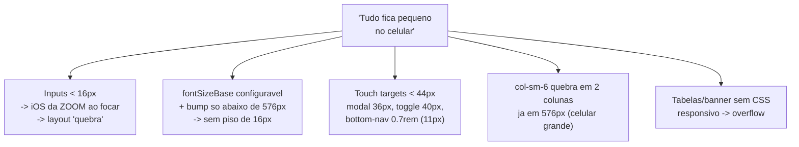
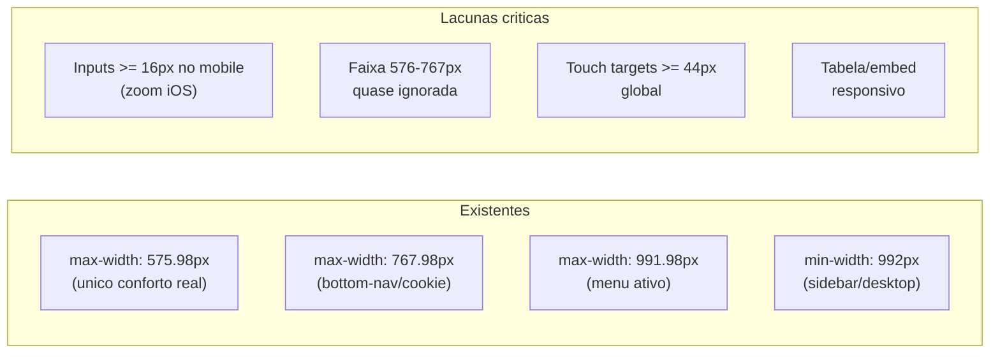
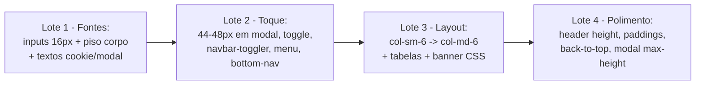

# Eixo 2 — Responsividade mobile

> Auditoria read-only de `tpl_generico/`, foco na queixa do usuário:
> **"hoje no celular muita coisa fica MUITO PEQUENA"**.
> Arquivo central: `media/css/template.css` (860 linhas) + `index.php` + overrides.

## Causa-raiz da queixa "tudo fica pequeno"



## Prioridades (o que mais ataca a queixa)

| Pri | ID | Achado | Sev. | Arquivo:linha |
|----:|----|--------|------|---------------|
| 1 | C1 | Inputs sem `font-size:16px` → zoom iOS | **Alta** | `template.css:253-264` |
| 2 | B1 | Corpo sem piso 16px; bump só < 576px | **Alta** | `template.css:19,437-441` |
| 3 | A4 | Itens de menu mobile sem altura de toque | **Alta** | `template.css:200-206` |
| 4 | A5 | Bottom-nav fonte 0.7rem + alvo < 44px | **Alta** | `template.css:531-541` |
| 5 | A2 | Fechar modal newsletter = 36×36px | **Alta** | `template.css:806-821` |
| 6 | A1 | `theme-toggle` 40×40px | Média | `template.css:471-485` |
| 7 | A3 | `navbar-toggler` sem `min-height` | Média | `index.php:234-247` |
| 8 | A6 | Cookie "Aceitar" usa `btn-sm` | Média | `index.php:359` |
| 9 | E1 | `top-*`/`bottom-*` em `col-sm-6` | Média | `index.php:291-292,315-316` |
| 10 | F1 | Tabelas de artigo sem scroll horizontal | Média | `article/default.php:184-186` |
| 11 | F3 | Banner `.banner-overlay`/`.overlay` sem CSS | Média | `mod_custom/banner.php:27-28` |
| 12 | D1 | Header `normal` 80px no mobile | Média | `template.css:139-141` |
| — | B3,B4,B5 | Textos de cookie/modal/h6 pequenos | Média/Baixa | `template.css:679,829-849,67-68` |
| — | A7 | Back-to-top oculto < 768px | Baixa | `template.js:147-153` |
| — | F2 | Embeds sem `aspect-ratio` | Baixa | `template.css:84-89` |
| — | G1,G2,G3 | Paddings de card/container/headings no mobile | Baixa | `template.css:272-285,443-447,70-77` |

## Achados detalhados (Altas)

### C1 — Inputs sem `font-size:16px` → **zoom automático no iOS** · Alta
O Safari iOS dá zoom ao focar qualquer input com `font-size < 16px`. O template não fixa
`16px` em `.form-control` (`template.css:253-264`); herdam `--tamanho-base-fonte`, que pode
ser configurado abaixo de 16px. Ao tocar no campo de e-mail (newsletter), busca, ou login
offline, o iOS dá zoom e desalinha o viewport — gerador clássico da sensação de
"tudo desalinhado/pequeno" no iPhone.
```css
@media (max-width: 767.98px) {
  .form-control, .form-select, input, textarea, select { font-size: 16px; }
}
```

### B1 — Corpo sem piso de 16px; bump só abaixo de 576px · Alta
`body { font-size: var(--tamanho-base-fonte, 1rem) }` (`:19`). Se o admin setar
`fontSizeBase` para `0.9rem`/`14px`, **todo o site fica pequeno**. O bump de +6,25%
(`:437-441`) só vale **abaixo de 576px** — celular paisagem e tablets pequenos (576–991px)
ficam no tamanho desktop cru. Sem piso garantido.
```css
body { font-size: clamp(1rem, 0.95rem + 0.4vw, var(--tamanho-base-fonte, 1rem)); }
/* ou: max(1rem, var(--tamanho-base-fonte)); estender conforto ate ~768px */
```

### A4 — Itens de menu mobile sem altura de toque · Alta · `template.css:200-206`
No offcanvas/collapse os `.nav-link` usam só o padding default do Bootstrap (~37px). É o
alvo mais usado no celular; a linha entre dois itens vira zona de erro.
```css
@media (max-width: 991.98px) {
  .offcanvas .nav-link, .navbar-collapse .nav-link, .dropdown-item {
    min-height: 44px; display: flex; align-items: center; padding-block: 0.65rem;
  }
}
```

### A5 — Bottom-nav: fonte 0.7rem (≈11px) + alvo < 44px · Alta · `template.css:531-541`
A barra fixa inferior (exclusiva do mobile) tem label `0.7rem` — literalmente "texto
pequeno demais" — e altura total < 44px, no elemento **mais tocado** do mobile.
```css
.bottom-nav li { min-height: 48px; }
.bottom-nav a  { font-size: clamp(0.72rem, 0.68rem + 0.4vw, 0.8rem); padding-block: 0.5rem; }
```

### A2 — Fechar modal newsletter = 36×36px · Alta · `template.css:806-821`
O "X" do modal tem 36×36px, no canto superior direito (zona difícil do polegar) e o
`fa-times` é ainda menor. É o controle de escape do modal.
```css
.newsletter-modal-close { width: 44px; height: 44px; }
```

## Achados detalhados (Médias)

### A1 — `theme-toggle` 40×40px · `template.css:471-485`
Abaixo de 44×44 (WCAG 2.5.5 / iOS 44pt / Android 48dp). `min-width:44px; min-height:44px;`.

### A3 — `navbar-toggler` sem `min-height` garantido · `index.php:234-247`
Herda só o padding do Bootstrap (~38px); dois togglers ficam lado a lado (`:234`/`:245`).
```css
.navbar-toggler { min-width: 44px; min-height: 44px; display: inline-flex;
  align-items: center; justify-content: center; }
```

### A6 — Cookie "Aceitar" `btn-sm` (~31px) · `index.php:359`
Único botão de ação do banner. Remover `btn-sm` no mobile ou `.cookie-notice-accept { min-height: 44px; }`.

### E1 — `top-*`/`bottom-*` em `col-sm-6` · `index.php:291-292,315-316`
`col-sm-6` força 2 colunas já em 576px (celular grande/paisagem ficam espremidos). **O footer
já foi corrigido nesta branch** (`col-12 col-md-6`); replicar a mesma correção em top/bottom:
```php
// de: <div class="col-sm-6">  para:  <div class="col-12 col-md-6">
```

### F1 — Tabelas de artigo sem scroll horizontal · `article/default.php:184-186`
Tabelas largas do editor estouram horizontalmente → scroll lateral da página inteira
(sensação de layout quebrado). `img/video/iframe` têm `max-width:100%` (`:84-89`), mas
**tabelas e `<pre>` não**.
```css
.com-content-article__body table { display: block; width: 100%; overflow-x: auto; }
.com-content-article__body pre   { overflow-x: auto; }
```
> ✅ **Feito** — a regra está no `template.css` (`.com-content-article__body table, pre`
> com `display:block; max-width:100%; overflow-x:auto`). Agora **coberta por teste**:
> `tests/specs/article-table.spec.js` (+ `fixtures/article-table.html`) abre o corpo de
> artigo num viewport de celular e verifica que tabela/`<pre>` largos rolam internamente
> e a **página não estoura** na horizontal.

### F3 — Banner `.banner-overlay`/`.overlay` **sem CSS** no pacote · `mod_custom/banner.php:27-28`
O override aplica `background-image` inline e envolve o conteúdo nessas classes, mas
**não há nenhuma regra CSS** para elas (confirmado por grep). No celular o banner pode
ficar sem altura controlada, imagem cortada/repetida, texto sem contraste.
```css
.banner-overlay { background-size: cover; background-position: center; }
.overlay { padding: clamp(1.5rem, 4vw, 4rem); }
```

### D1 — Header `normal` 80px no mobile · `template.css:139-141`
Se `headerHeight=normal`, o header fixo come 80px no celular (encolhe só após scroll).
```css
@media (max-width: 767.98px) { .header.header-normal .navbar { min-height: 60px; } }
```

## Achados Baixos (resumo)
- **B3** cookie text `0.9rem` → `clamp(0.9rem, ..., 1rem)`; **B4** erro do modal `0.85rem` → mín. `0.9rem`; **B5** `h6` piso `0.9rem` → `0.95–1rem`.
- **A7** back-to-top oculto < 768px (`template.js:147-153`) — reavaliar: páginas longas no celular ficam sem atalho ao topo.
- **F2** embeds sem `aspect-ratio` (vídeos podem desproporcionar) → wrapper `.ratio`.
- **G1** cards mantêm `1.5rem` de padding no celular; **G2** padding lateral só ajustado < 576px (lacuna 576–767px); **G3** headings com `margin-top:2rem` grande no mobile.
- **I1/I2** modal sem `max-height`/scroll interno e botões lado a lado (preferir `column` + `w-100` no mobile).

## Inventário de media queries (e lacunas)



**Conformes (boas práticas já presentes):** tipografia de headings com `clamp()`
(`:63-68`), `overflow-wrap:break-word` no body, `env(safe-area-inset-bottom)` na bottom-nav
e cookie, imagens `max-width:100%`, viewport em todas as 4 páginas. **A correção é estender
essa filosofia (clamp/piso 16px) ao corpo, inputs, bottom-nav, cookie e textos de modal.**

## Plano de ação do eixo



> Ao alterar CSS/overrides, **atualizar a fixture/spec Playwright** em `tests/` (regra do `CLAUDE.md`).
> Testar em retrato + paisagem + tablet pequeno antes de versionar.

## Achado adicional (descoberto no Joomla real) — ✅ corrigido

- **Aviso de cookies cobria o back-to-top:** ambos são `position: fixed` na base; o
  aviso (`left:0;right:0;bottom:0`, `z-index:1050`) ficava **sobre** o botão
  (`bottom:1.25rem`, `z-index:1035`), interceptando o clique até o auto-aceite
  (~20s). **Correção:** o `template.js`, ao exibir o aviso, marca
  `body.has-cookie-notice` e expõe a altura real em `--cookie-notice-height`; o
  `template.css` então **sobe** o back-to-top para acima do aviso
  (`bottom: calc(var(--cookie-notice-height) + 0.75rem)`) e eleva seu `z-index`
  para 1051. O back-to-top só aparece no desktop (≥768px), onde o aviso é uma
  barra inferior. Coberto por `tests/specs/e2e/back-to-top.e2e.spec.js` (clica no
  botão com o aviso visível, valida que fica acima e clicável em <3s).
