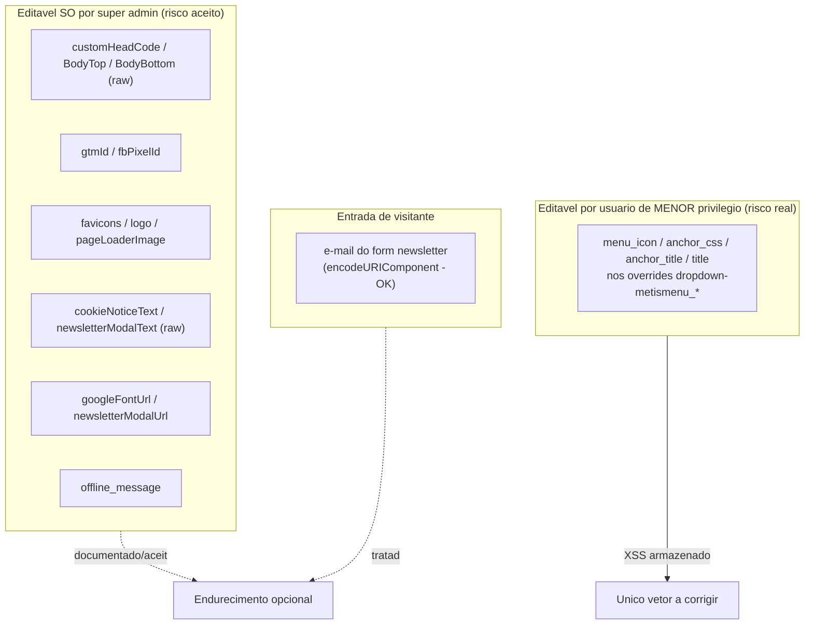
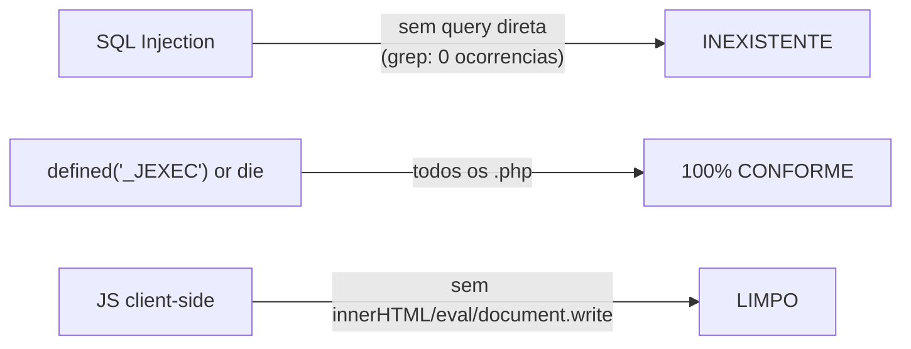
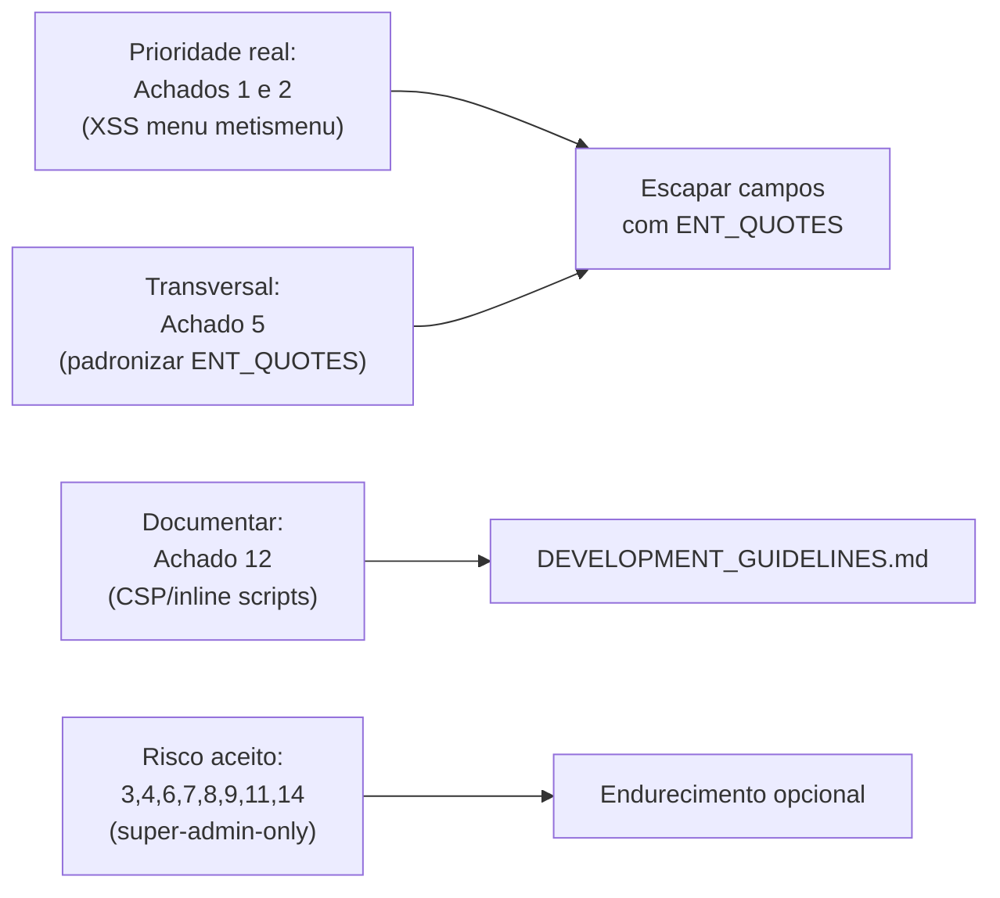

# Eixo 3 — Segurança (AppSec)

> Auditoria read-only de `tpl_generico/`. Severidade: **Crítica / Alta / Média / Baixa**.
> **Perfil de risco geral: BAIXO.** Nenhuma vulnerabilidade Crítica ou Alta confirmada.
> O risco é dominado por campos administrativos de **alto privilégio (super admin)** = risco aceito.

## Modelo de ameaça



## Confirmações de base



- **SQL Injection: inexistente.** O template não faz nenhuma query ao banco (dados de menu/breadcrumb/artigo vêm prontos do core). Sem superfície de SQLi.
- **`_JEXEC`: 100% conforme** em todos os `.php` (index, helper, error, offline, component e os 13 overrides).
- **JS client-side: limpo.** `template.js` usa só `textContent`/`setAttribute`/`classList`; `localStorage` parseado/comparado contra valores fixos; `window.location.assign` com `encodeURIComponent`; cookie com `SameSite=Lax`+`Secure`. Sem `innerHTML`/`eval`/`document.write`.

## Tabela de achados

| ID | Achado | Sev. | Privilégio | Arquivo:linha |
|----|--------|------|-----------|---------------|
| 1 | XSS via `menu_icon`/`anchor_css`/`menu_image` no menu | **Média** | Editor de menu | `dropdown-metismenu_url/component/heading/separator.php` |
| 2 | `anchor_title`/`aria-label` do menu sem escape | **Média** | Editor de menu | `dropdown-metismenu_url.php:19,70` |
| 5 | Inconsistência `ENT_COMPAT` vs `ENT_QUOTES` | Baixa | — | múltiplos |
| 3 | `customHeadCode`/Body* injetados crus | Baixa | Super admin | `index.php:196-202,213-214,403-404` |
| 4 | `newsletterModalText`/`cookieNoticeText` crus | Baixa | Super admin | `index.php:358,371` |
| 6 | Favicons sem validação de caminho | Baixa | Super admin | `index.php:25-31` |
| 7 | `gtmId`/`fbPixelId` em `<script>` com escape HTML | Baixa | Super admin | `index.php:187,190` |
| 8 | `googleFontUrl` sem validação de host | Baixa | Super admin | `index.php:47-55` |
| 9 | `banner.php` `$module->content` cru | Baixa | Admin de módulo | `mod_custom/banner.php:21-29` |
| 10 | Form newsletter GET sem CSRF | Baixa (ok) | — | `index.php:372-380` |
| 11 | `newsletterModalUrl` open redirect | Baixa | Super admin | `index.php:136-143` |
| 12 | Sem headers de segurança / incompatível com CSP estrita | Baixa (info) | — | `index.php` (inline scripts) |
| 13 | `_JEXEC` presente | Conforme | — | todos |
| 14 | `offline_message` cru | Baixa | Super admin | `offline.php:60-62` |
| 15 | JS client-side | Sem achados | — | `template.js` |

## Achados detalhados

### 1 — XSS armazenado via atributos de menu · **Média** · `dropdown-metismenu_*`
**Único vetor explorável por usuário de menor privilégio.** Um usuário com permissão de
gerenciar itens de menu (não precisa ser super admin) define `menu_icon`, `anchor_css`,
`menu_image_css` ou `title` com payload, que vai **direto para dentro de `class="..."`**
sem `htmlspecialchars`. Trecho representativo (`dropdown-metismenu_url.php:36`):
```php
$linktype = '<span class="p-2 ' . $item->menu_icon . '" aria-hidden="true"></span>' . $item->title;
```
e (`_heading.php:23`): `$attributes['class'] .= $item->anchor_css ? ' ' . $item->anchor_css : null;`
seguido de `ArrayHelper::toString($attributes)` — que **não** faz HTML-escape.

> **Contraste revelador:** o override **próprio** `mod_menu/default.php` já escapa tudo
> corretamente (`htmlspecialchars($title, ENT_QUOTES)`, linhas 106/119/125). A falta de
> escape nos metismenu é só **herança do core Cassiopeia** — daí a recomendação de corrigir
> por consistência.

**Correção:** escapar antes de concatenar:
```php
$title    = htmlspecialchars($item->title, ENT_QUOTES, 'UTF-8');
$iconCss  = htmlspecialchars($item->menu_icon, ENT_QUOTES, 'UTF-8');
$linktype = '<span class="p-2 ' . $iconCss . '" aria-hidden="true"></span>' . $title;
// idem anchor_css / menu_image_css antes de entrar em $attributes
```

### 2 — `anchor_title`/`aria-label` do menu sem escape · **Média** · `dropdown-metismenu_url.php:19,70`
`$attributes['title'] = $item->anchor_title;` e `aria-label="' . $item->title . '"` no
botão `mm-toggler`. Editor coloca `" onmouseover="alert(1)` → quebra o atributo. Mesmo
modelo do achado 1. **Correção:** `htmlspecialchars(..., ENT_QUOTES, 'UTF-8')`.

### 5 — Inconsistência `ENT_COMPAT` vs `ENT_QUOTES` · Baixa
`ENT_COMPAT` **não escapa aspas simples** (`'`). Usado em `index.php:74` (siteTitle),
`error.php:42`, `offline.php:42`, `mod_breadcrumbs/default.php:38,41`, `dropdown-metismenu_url.php:67`.
O correto (`ENT_QUOTES`) é usado em `index.php:58,72,395`, `mod_menu/default.php`, chromes.
Impacto prático baixo hoje (valores vão para atributos com aspas duplas), mas vira bug se
alguém mudar o delimitador. **Correção:** padronizar `htmlspecialchars($v, ENT_QUOTES, 'UTF-8')`
onde o valor puder ir para atributo.

### 3 — `customHeadCode`/`customBodyTopCode`/`customBodyBottomCode` crus · Baixa (risco aceito)
HTML/JS arbitrário é a **funcionalidade pretendida** (GTM, Pixel, widgets de chat). Só super
admin acessa. Não escapar — quebraria a função. Já documentado em comentário (`index.php:193-195`)
e no `CLAUDE.md`. **Endurecimento opcional:** gate por ACL específica; deixar claro na
`description` do campo que o conteúdo é injetado cru.

### 4 — `newsletterModalText`/`cookieNoticeText` crus · Baixa (risco aceito)
`filter="raw"` para permitir formatação (negrito, link) — intencional, super-admin-only.
Note a inconsistência **coerente**: `newsletterModalTitle` (`:370`) É escapado; o
`newsletterModalText` (`:371`) não (corpo permite markup). **Endurecimento opcional:** trocar
para `filter="safehtml"` (mantém formatação, remove `<script>`/handlers).

### 6 — Favicons sem validação de caminho · Baixa (super admin)
`faviconIco/Png32/Apple` são `type="text" filter="string"` — aceitam `../../configuration.php`
ou URL externa. Como só geram `<link rel=icon>`/``, o pior caso é referenciar recurso
externo (leak de referer) — **não há XSS** (o `htmlspecialchars` previne quebra do atributo).
**Endurecimento:**
```php
$fav = ltrim((string) $this->params->get('faviconIco'), '/');
if ($fav !== '' && !preg_match('#(^\w+://|\.\.)#', $fav)) { /* addHeadLink */ }
```

### 7 — `gtmId`/`fbPixelId` em `<script>` com escape HTML · Baixa (super admin)
`htmlspecialchars` é escape HTML, não JS — mas em PHP 8.1+ o default já é `ENT_QUOTES` e
`<`/`>` são escapados, então `</script>` não fecha a tag e o pior caso é ID inválido (não
executa JS). Questão de **corretude** mais que segurança. **Endurecimento:** validar formato
(`/^GTM-[A-Z0-9]+$/`) e/ou `json_encode($gtmId)` para a string JS.

### 8 — `googleFontUrl` sem validação de host · Baixa (super admin)
`filter="url"` sanitiza a URL mas não restringe o host — admin pode apontar para
`https://atacante/x.css` (CSS pode exfiltrar via `background:url()`). Não é XSS.
**Endurecimento:** validar `parse_url(..., PHP_URL_HOST) === 'fonts.googleapis.com'`.

### 9 — `banner.php` `$module->content` cru · Baixa (risco aceito)
HTML do módulo Custom — cru por design (admin). A URL da imagem passa por
`HTMLHelper::_('cleanImageURL')->url` (sanitiza). Sem quebra de contexto por visitante.

### 10 — Form newsletter GET sem CSRF · Baixa (correto assim)
É **navegação**, não ação de estado: o form só monta `?email=...` e leva o visitante ao
registro. GET sem token é apropriado (quem processa é o destino). Contraste correto:
`offline.php:65-81` usa POST **com** `form.token` por ser login real. **Nada a corrigir.**

### 11 — `newsletterModalUrl` open redirect · Baixa (super admin)
Se casar `^https?://` é usada como está; o destino é definido pelo admin (não por atacante).
O `htmlspecialchars(ENT_QUOTES)` no `action` previne XSS. **Aceitável**; documentar que a URL é confiada.

### 12 — Sem headers de segurança / incompatível com CSP estrita · Baixa (info)
Emitir headers (CSP, X-Frame-Options) é função do **plugin "HTTP Headers" do Joomla**, não do
template — não é defeito. Mas o **uso intenso de `<script>`/`<style>` inline** (tema `:157-168`,
GTM `:187`, Pixel `:190`, `:root` `:43`, JSON-LD) torna o template incompatível com
`script-src 'self'` sem `'unsafe-inline'`/nonce.
**Recomendação:** documentar no `DEVELOPMENT_GUIDELINES.md` a necessidade de nonce para CSP;
onde possível mover o script de tema para arquivo com `data-*` (trade-off: reintroduz flash
de tema — provavelmente não compensa; documentar a escolha).

### 14 — `offline_message` cru · Baixa (super admin)
`echo $app->get('offline_message')` — conteúdo da Configuração Global (super admin), por
design pode conter HTML. Paridade com o core Cassiopeia. **Sem ação.**

## Conclusões



- **Corrigir:** achados **1 e 2** (XSS nos overrides metismenu) — único vetor de menor privilégio. Severidade Média.
- **Padronizar:** achado **5** (`ENT_QUOTES` em todo lugar que vai para atributo).
- **Documentar:** achado **12** (incompatibilidade com CSP estrita por inline scripts).
- **Risco aceito (opcional):** 3, 4, 6, 7, 8, 9, 11, 14 — super-admin-only, já parcialmente documentado.

## Plano de ação do eixo

1. **Correção de XSS** (1, 2): escapar `menu_icon`, `anchor_css`, `menu_image_css`, `anchor_title`, `title`, `aria-label` nos 4 overrides `dropdown-metismenu_*`. Baixo risco de regressão (apenas adiciona escape).
2. **Padronização** (5): varrer `ENT_COMPAT` → `ENT_QUOTES` onde for atributo.
3. **Documentação** (12): seção de CSP/nonce no guia de desenvolvimento.
4. **Endurecimento opcional** (6, 7, 8): validação de caminho de favicon, formato de GTM/Pixel, host da Google Font — só se houver apetite; não são obrigatórios.
