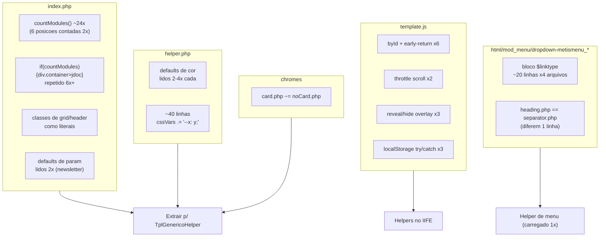
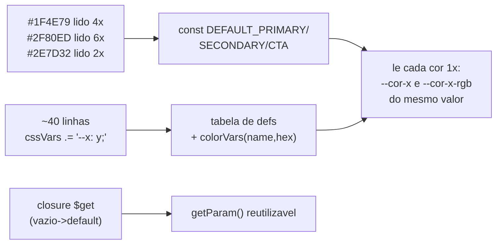
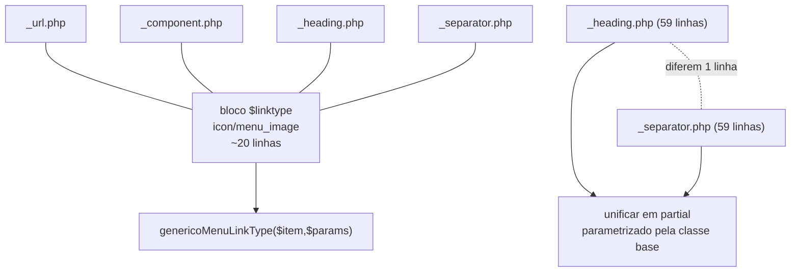
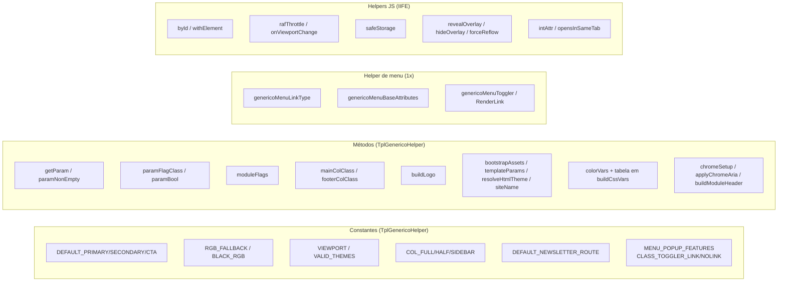
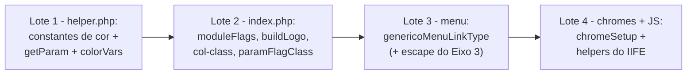

# Eixo 4 — Redução de código duplicado

> Auditoria read-only de `tpl_generico/`. Foco do usuário: **duplicação no MESMO arquivo,
> criando constantes e métodos**. Também listada a duplicação entre arquivos (secundária).
> Alvo principal de extração: a classe `TplGenericoHelper` (`helper.php`).

## Mapa dos clusters de duplicação

## A. `index.php` (intra-arquivo)

| ID | Tipo | Problema | Recomendação |
|----|------|----------|--------------|
| A1 | Bloco/Lógica | `($params->get('x','1')==='1')?'classe':''` em :86,87,88 (+booleanos :98,107,113,155) | `TplGenericoHelper::paramFlagClass()` / `paramBool()` |
| A2 | Lógica/redundância | `countModules()` ~24×; 6 posições contadas 2× (top-a/b, bottom-a/b, mobile-menu, menu) | cachear em array `$has[...]` ou `moduleFlags($doc, $positions)`; constantes de posição |
| A3 | Bloco | `if(countModules){
<jdoc>
}` em :217,220,275,280,286,319 | `openModulePosition()`/`closeModulePosition()` |
| A4 | Bloco | `row` com 2× `col-sm-6` idêntico em :289-294 e :313-318 | partial `renderTwoColRow()`; `const COL_HALF` |
| A5 | Literal | `'col-12'`/`'col-lg-3'`/`'col-sm-6'` espalhados (:80,287,320,336-338,81,82,297,308...) | `const COL_FULL`, `COL_SIDEBAR`, `COL_HALF` |
| A6 | Lógica | cadeia `if/elseif` do `$colClass` do footer (:336-338) e `$mainClass` (:80-82) | `footerColClass(int)` / `mainColClass(bool,bool)` |
| A7 | Bloco | `<aside>` de sidebar-left (:296-300) e -right (:307-311) idênticos | `renderSidebar($id,$pos,$labelKey)` |
| A8 | Lógica | montagem do logo ``/`` (:69-75) repetida em error/offline | `buildLogo($params,$sitename,$opts)` |
| A9 | Literal/Lógica | defaults de newsletter lidos 2× (rota, `'email'`, `60`) em :128-147 | `paramNonEmpty()`; `const DEFAULT_NEWSLETTER_ROUTE` |
| A11 | Bloco | `Uri::root(false).htmlspecialchars(...)` em :72,393 (+favicons :25-31) | `assetUrl($path,$absolute)` |
| A12 | Bloco | 3× `addHeadLink` de favicon quase idênticos (:24-32) | loop sobre array de definições |
| A13 | Bloco | `dnsPrefetch+preconnect` 2× (:177-184) | helper local `warmup($preload,$host)` |
| A10 | Literal | chave `'generico-theme'` em :158 (PHP) e `template.js:87` (JS) | `const THEME_STORAGE_KEY` + `data-*` |

## B. `helper.php` (intra-arquivo) — maior ganho isolado

| ID | Problema | Recomendação |
|----|----------|--------------|
| B1 | `'#1F4E79'` em :41,49,89; `'#2F80ED'` em :43,46,47,51,91; `'#2E7D32'` em :42,50,90 — default lido 2–4× | `private const DEFAULT_PRIMARY='#1F4E79'` etc.; ler cada cor **uma vez** e gerar `--cor-x` + `--cor-x-rgb` do mesmo valor |
| B2 | ~40 linhas no formato `$cssVars .= "--nome: valor;"` (:41-108) | tabela `['--cor-primaria' => $primary, ...]` + `colorVars($name,$hex)` que devolve cor+rgb juntas |
| B3 | closure `$get` (vazio/null→default) só local (:33-39) | promover a `TplGenericoHelper::getParam($params,$key,$default)` (reusado por index/error/offline/component) |
| B4 | `'0, 0, 0'` fallback (:126) | `const RGB_FALLBACK='0, 0, 0'` |

## C. `media/js/template.js` (intra-arquivo)

| ID | Problema (ocorrências) | Recomendação |
|----|------------------------|--------------|
| C1 | `var el=getElementById(id); if(!el)return;` ×6 (:39,82,142,206,282,366) | `byId(id)` + `withElement(id, fn)` |
| C2 | throttle `ticking`+`requestAnimationFrame` idêntico ×2 (:53-62, :160-169) | `rafThrottle(fn)` |
| C3 | `addEventListener('resize'/'orientationchange', fn, {passive})` ×2 (:66-67, :132-133) | `onViewportChange(fn)` |
| C4 | `localStorage` try/catch ×3 (:104-106, :374-377) — `store` está em escopo local | promover `store`/`safeStorage` ao escopo do IIFE |
| C5 | reveal/hide de overlay (reflow + timeout) ×3 (cookie, loader, modal) | `revealOverlay()`/`hideOverlay()`/`forceReflow()` |
| C6 | `Array.prototype.forEach.call` ×2 (:126,188) | `forEach(list,fn)` ou `NodeList.forEach` |
| C7 | `parseInt(data-*)` + fallback ×2 (:220-223, :384-387) | `intAttr(el,name,fallback)` |
| C8 | `target && target !== '_self'` ×2 (:316-318, :345-348) | `opensInSameTab(el)` |

## D. Overrides de menu (`html/mod_menu/dropdown-metismenu_*`) — duplicação entre arquivos

| ID | Problema | Recomendação |
|----|----------|--------------|
| D1 | bloco `$linktype` (icon/image) **idêntico em 4 arquivos** (~20 linhas) | `genericoMenuLinkType($item,$itemParams,$hiddenVariant)` em helper de menu |
| D2 | init de `$attributes` (anchor_title/css/rel) repetido 4× | `genericoMenuBaseAttributes($item)` |
| D3 | bloco do toggler (`mm-toggler-link`/`-nolink`) duplicado 2×+2× | `genericoMenuToggler($item)`; `const CLASS_TOGGLER_LINK/NOLINK` |
| D4 | **`heading.php` ≈ `separator.php`** — diferem só na classe base (linha 22) | unificar num partial parametrizado |
| D5 | string `window.open` features duplicada (:62/:65) | `const MENU_POPUP_FEATURES` |
| D6 | `HTMLHelper::link(...)` idêntico (_url:67, _component:70) | `genericoMenuRenderLink($item,$linktype,$attributes)` |
| D7 | `default.php`: `'active'`/`'dropdown'`/`'nav-item'`/`'nav-link'` repetidos (:86-103) | constantes + arrays de classe + `implode` |
| D8 | `default.php`: `htmlspecialchars($title,ENT_QUOTES)` 2× (:106,125) | `$titleEsc` computado 1× |

> **Atenção (cruza com Eixo 3):** ao tocar nesses overrides, aplicar o escape do achado de
> segurança 1/2 junto da extração — a função compartilhada `genericoMenuLinkType()` é o lugar
> certo para centralizar `htmlspecialchars`.

## E. `chromes/card.php` vs `noCard.php` — duplicação entre arquivos

| ID | Problema | Recomendação |
|----|----------|--------------|
| E1 | setup (`$moduleTag`,`$headerTag`,`$headerClass`...) quase idêntico; muda só `' card '` vs `' no-card '` (:15-28/:15-27) | `TplGenericoHelper::chromeSetup($displayData,$variantClass): array` |
| E2 | bloco "aria se moduleTag != div" idêntico (:42-49/:36-43) | `applyChromeAria(&$mod,&$hdr,$module,$tag)` |
| E3 | montagem do `$header` idêntica (:51/:45) | `buildModuleHeader($tag,$attrs,$title)` |

## F. Duplicação entre entrypoints (index/error/offline/component) — secundária

| ID | Problema | Recomendação |
|----|----------|--------------|
| F1 | setup de assets + `:root` CSS vars em 4 arquivos | `bootstrapAssets($doc,$wa,$params)` |
| F2 | `getTemplate(true)->params` com try/catch em error/offline/component | `templateParams($app): ?Registry` |
| F3 | `in_array($colorScheme,['light','dark'],true)?...:'light'` (index:150, component:38) | `resolveHtmlTheme($params)`; `const VALID_THEMES` |
| F4 | larguras de logo dispersas (error 200, offline 240, index 150) | constantes no helper / `buildLogo()` |
| F5 | viewport `'width=device-width, initial-scale=1'` em 4 lugares (1 vs 1.0) | `const VIEWPORT` + padronizar |
| F6 | abertura `<html lang dir>` repetida | difícil extrair markup; documentar |
| F7 | `$sitename` fallback de logo 2× por arquivo | coberto por `buildLogo()` |

## Consolidado — o que criar

## Maiores ganhos (prioridade)

1. **D1/D4** — overrides de menu: ~20 linhas duplicadas em 4 arquivos; `heading.php`≈`separator.php`. **Cruza com a correção de XSS (Eixo 3)** — fazer junto.
2. **B1/B2** — `helper.php`: defaults de cor lidos 2–4× e ~40 linhas de concatenação. Maior cluster intra-arquivo.
3. **A2** — `index.php`: `countModules()` redundante (6 posições contadas 2×).
4. **C5** — `template.js`: reveal/hide de overlay duplicado 3×.
5. **E1-E3** — chromes card/noCard quase idênticos.

## Restrição de empacotamento (importante)

> Se a extração criar um **arquivo `.php` novo** (ex.: um `menu-helper.php` compartilhado
> pelos overrides metismenu), ele **deve ser declarado em `templateDetails.xml` `<files>`**
> — caso contrário o instalador do Joomla não o copia e gera fatal em produção (incidente
> real documentado no `CLAUDE.md`). Alternativa sem arquivo novo: concentrar tudo na classe
> `TplGenericoHelper` já listada. Helpers JS ficam no `template.js` existente (sem arquivo novo).

## Plano de ação do eixo

## Status de implementação (Fase 4)

> Critério desta fase: priorizar refactors **mecanicamente seguros** (sem mudança
> de comportamento comprovável), já que não há PHP local e só parte do JS tem
> cobertura de teste. Refactors que **alteram o HTML gerado** (montagem de markup)
> ficam para quando houver Joomla local/homologação.

### Feito
- **B1/B3/B4 (`helper.php`):** constantes `DEFAULT_PRIMARY/SECONDARY/CTA` e
  `RGB_FALLBACK`; closure `$get` promovido a `TplGenericoHelper::getParam()`
  (público, reutilizável); cada cor de marca **lida uma vez** e reaproveitada para
  `--cor-*`, `--cor-*-rgb` e `--bs-*-rgb`. **Saída CSS idêntica** (mesma ordem e
  valores) — verificado linha a linha.
- **C1–C8 (`media/js/template.js`):** helpers no IIFE — `byId`, `forEach`,
  `forceReflow`, `onViewportChange`, `rafThrottle`, `intAttr`, `opensInSameTab` e
  `safeStorage` (promovido do `store` local do modal) — aplicados em todos os
  inicializadores. Extrações fiéis (sem mudança de comportamento).
- **Testes:** novo fluxo funcional do **aviso de cookies**
  (`tests/specs/cookie-notice.spec.js` + fixture) cobrindo aparecer → aceitar /
  auto-aceitar → gravar consentimento → não reaparecer (exercita o caminho
  refatorado: `intAttr`/`byId`). Suíte: **38/38 verdes**.

### Adiado (com justificativa)
- **B2 (tabela genérica de `--var: valor`):** ganho cosmético; reestruturar as ~30
  linhas em uma tabela aumenta o risco de reordenar/perder uma var sem PHP local
  para validar. O maior valor (ler cada cor 1×) já foi capturado.
- **A* (`index.php`): `moduleFlags`, `buildLogo`, `renderSidebar`, `openModulePosition`, `col-class`** — mudam a montagem do HTML e o `index.php` não tem teste de render. Requer Joomla local.
- **D* (overrides de menu):** dedup via `genericoMenuLinkType()` mexe em 4 arquivos
  recém-alterados na Fase 1 e altera markup; o escape de segurança já foi aplicado
  lá (Fase 1). Fazer junto de uma validação em instalação real.
- **E* (chromes `card`/`noCard`):** `chromeSetup`/`buildModuleHeader` alteram a
  saída dos cards de módulo, sem teste de render. Adiar.
- **F* (entre entrypoints):** secundário (o foco é intra-arquivo); `getParam` já
  cobre parte de F2/B3.
