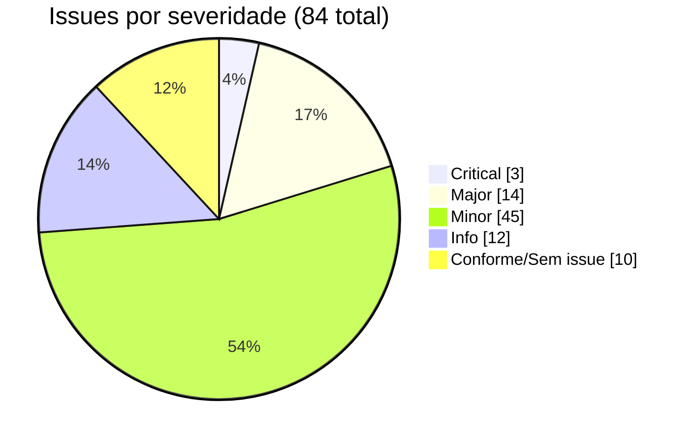
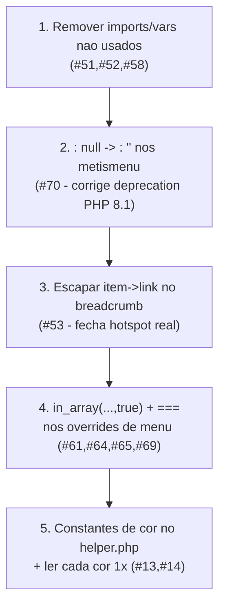

# Eixo 5 — Issues SonarQube / PHPMD / ESLint

> Análise estática read-only de `tpl_generico/`. Severidades no estilo SonarQube
> (**Blocker / Critical / Major / Minor / Info**) e tipo (**Bug / Vulnerability / Code Smell**).

## Resumo quantitativo

| Severidade | Qtd | Exemplos |
|------------|----:|----------|
| Blocker | 0 | — |
| Critical | 3 | literais de cor ≥4× no `helper.php`; hotspots de saída crua; `href` de breadcrumb não escapado |
| Major | ~14 | complexidade de `buildCssVars`/`renderMenuItems`/`initNewsletterModal`; duplicações; funções globais no menu; `.= null` (deprecation PHP 8.1); asset `offline` inexistente; `if` sem chaves |
| Minor | ~45 | `var`→`const`/`let`; `==`→`===`; `in_array` sem strict; imports/vars não usados; magic numbers; dead stores; cores hardcoded CSS; const no meio do arquivo |
| Info | ~12 | tabs/espaços; parênteses redundantes; `@media` range vs min-width |

## Literais duplicados (regra S1192 "Define a constant…")

| Literal | Ocorrências | Onde |
|---------|------------:|------|
| `'#2F80ED'` (CTA) | ~7× | `helper.php` (43,46,47,51,91,98) + fallbacks no CSS |
| `'#1F4E79'` (primária) | 4× | `helper.php` (41,49,89,100) + CSS |
| `'#FFFFFF'`/`#fff` | muitas | `helper.php` (54,55) + CSS (105,315,325,...) |
| `htmlspecialchars(...,ENT_QUOTES,'UTF-8')` | ~15× | index, error, offline, chromes |
| `'index.php?option=com_users&view=registration'` | 2× | `index.php` (136,138) |
| `'generico-theme'` (localStorage) | 2× | `index.php:158` + `template.js:87` (**risco de drift cross-file**) |
| `' active'`/`'nav-link'` | várias | overrides de menu |
| bloco `` | 4 arquivos | `dropdown-metismenu_*` |
| `rgba(0,0,0,...)` box-shadow | 7× | `template.css` (464,509,582,650,715,737,797) |

## Por arquivo (achados de maior peso)

### `index.php`
- **#1/#2 (Major, S121):** `if` sem chaves em uma linha — `:81,82` (`$mainClass`) e `:337,338` (footer `$colClass`). Envolver em `{ }`.
- **#3 (Minor, S1192):** rota de registro duplicada (`:136,138`) → constante local.
- **#4 (Major):** "god file" — ~150 linhas de bootstrap (favicon, CSS vars, fonts, GTM/Pixel, tema, cookie, newsletter, loader). Extrair para `helper.php` (`buildNewsletterConfig`, `buildThemeBootstrapScript`, `buildTrackingHead`).
- **#6 (Minor):** casts `(int)` sem clamp (`:69 logoWidth`, `:108 cookieTimeout`) — usar `max(0, ...)`.
- **#7 (Critical, S5131 hotspot):** saída crua `:214,358,371,404` — `filter="raw"` intencional, mas Sonar levanta; marcar reviewed/justificar. `$newsletterText`/`$cookieText` não escapados (≠ `$newsletterTitle`).
- **#8 (Minor):** classe do `<body>` por concatenação encadeada (`:209`) → `implode(' ', array_filter(...))`.
- **#9 (Minor):** `$preload` obtido 2× (`:49,176`).
- **#10 (Minor, S103):** linhas > 120 col (`:72,187,190`) — extrair scripts para helper.
- **Bom:** comparações estritas (`=== '1'`, `in_array(...,true)`) já usadas.

### `helper.php`
- **#11 (Minor):** sem type hints — `buildCssVars($params)`→`(?Registry $params): string`; `hexToRgb(?string): string`; return type em `__call*`.
- **#12 (Major, ExcessiveMethodLength):** `buildCssVars` ~80 linhas → tabela `$map` + loop; separar bloco Bootstrap.
- **#13 (Critical, S1192):** cores default repetidas (`#1F4E79`×4, `#2F80ED`×6) → constantes + ler cada cor 1×.
- **#14 (Minor):** `$get(...)` chamado 2× por cor (uma p/ `--cor-x`, outra p/ `hexToRgb`) → capturar em variável.
- **#15 (Minor):** cadeia `if/elseif` de spacing (`:70-77`) → `match`.
- **#16 (Minor):** `__call`/`__callStatic` engolem chamadas retornando `''` (mascara bugs; params não usados) — dívida técnica de compat a rastrear com `// TODO`.

### `media/js/template.js`
- **#18 (Minor, no-var):** arquivo inteiro usa `var` → `const`/`let` (muitas imutáveis: `KEY`, `root`, `emailRe`, `DONE_KEY`).
- **#20 (Minor, no-empty):** `catch (e) {}` (`:106,376` + inline `index.php:161`) — adicionar comentário justificando (Sonar aceita catch comentado).
- **#21 (Minor, no-magic-numbers):** `300`, `12000`, `365*24*60*60*1000`, `0.6`, `24` → constantes nomeadas (`HIDE_TRANSITION_MS`, `SAFETY_TIMEOUT_MS`, `COOKIE_DAYS`).
- **#22 (Minor):** padrões pré-ES2020 (`:335,345,452`) → optional chaining `?.`/`??`.
- **#23 (Minor):** listeners globais sem cleanup — page-lifetime, baixo impacto; usar `AbortController` ou documentar.
- **#24 (Major):** `initNewsletterModal` ~120 linhas (9 sub-funções) — extrair handlers nomeados; `initPageLoader`/`initCookieNotice` também grandes.
- **#25 (Minor):** wrapper try/catch de `localStorage` duplicado (`:104-106` vs `:374-377`) → `safeStorage` único.
- **Bom:** `===` consistente; IIFE com `'use strict'`; `parseInt(...,10)`.

### `error.php` / `offline.php`
- **#29/#34 (Minor):** `const ..._LOGO_WIDTH` no meio do arquivo → topo.
- **#31/#83 (Info):** indentação com **tabs** no try/catch (resto usa 4 espaços) → `.editorconfig`.
- **#32/#35 (Minor, dead store):** `$logo = ''` nunca lido (todos os ramos sobrescrevem) — também `index.php:70`.
- **#30 (Minor):** `while ($loop === true)` com atribuição-na-condição (herdado do core) — aceitável.
- **#36 (Major hotspot):** `echo $app->get('offline_message')` cru — padrão Joomla; justificar.
- **#37 (Major, Bug potencial):** `useStyle('tpl_generico.offline')` — **`offline.css` não existe / URI não bate** (ver `CLAUDE.md`); numa instalação limpa o asset não carrega. Corrigir o `joomla.asset.json`.

### `component.php`
- **#38 (Minor):** `require_once helper.php` (`:25`) depois de `getWebAssetManager()` — ordem inconsistente vs outros entrypoints. Bom uso de strict comparison.

### `html/com_content/article/default.php` + `default_items.php`
- **#39 (Minor):** catch só com comentário, captura `Exception` ampla (`:82-84`) → `\Throwable` + log debug.
- **#40/#46 (Minor):** `==`/`!=` frouxos (`:140,158,188,207,211`) — `$info` pode ser `"0"` vs `0`; `== true` redundante → `(int)$info === 0`, `!== null`.
- **#41/#47 (Minor, bloco duplicado):** `$useDefList` (8 `||`) duplicado em `default.php:132-133` e `default_items.php:40-41` → `shouldShowDefList($params)`.
- **#43 (Minor):** `$app`/`$document` redeclarados (`:26-27` e `:101-102`).
- **#44 (Info):** `if(...)` sem espaço (PSR-12).
- **#45 (Minor):** `class="row<?= $i%2 ?>"` pouco semântico → `'odd'/'even'`.

### `chromes/card.php` + `noCard.php`
- **#48 (Major, S4144):** setup quase-idêntico entre os dois (`card:23-49` ≈ `noCard:23-45`) → função/partial compartilhado (ver Eixo 4 E1).
- **#49 (Minor):** `'mod-' . $module->id` 2×; `'card-title'` em 32/58 → variável.
- **#50 (Minor):** mistura `if(): endif;` com `{ }` no mesmo arquivo — padronizar.

### `html/mod_breadcrumbs/default.php`
- **#51 (Minor, S1128):** `use ...Text;` não usado → remover.
- **#52 (Minor, S1481):** `$siteName` atribuída e nunca lida → remover.
- **#53 (Major hotspot):** `'<a href="' . $item->link . '">'` — `$item->link` **sem escape** (o `$item->name` é escapado) → `htmlspecialchars($item->link, ENT_QUOTES, 'UTF-8')`. **Quick win de segurança.**
- **#54 (Minor):** `count($list)` dentro do loop (`:36`) → cachear `$total`.

### `html/mod_custom/banner.php`
- **#56 (Minor):** `$app`/`$module`/`$params` sem docblock `@var` (só `$wa` tem).
- **#57 (Minor hotspot):** `background-image: url("...")` dinâmico — `cleanImageURL` sanitiza; documentar.

### `html/mod_menu/default.php`
- **#58 (Minor, S1128):** `use HTMLHelper` e `use Text` não usados → remover.
- **#59 (Major):** funções globais `genericoMenuBranchHasActive`/`renderMenuItems` poluem namespace; `renderMenuItems` é nome genérico (colisão) → prefixar/closure.
- **#60 (Major):** `renderMenuItems` ~85 linhas, recursiva, complexidade > 15 → extrair `buildMenuItemClass`/`buildLinkAttrs`.
- **#61 (Minor):** `in_array($id, $path)` sem `true` (`:30,80`).
- **#63 (Minor, shadow):** `$id` reusado para coisas diferentes (`:63` id do item vs `:138` id do `<ul>`) → `$ulId`.

### `html/mod_menu/dropdown-metismenu*.php`
- **#66 (Major):** loop com ~10 `if` + dois `switch` (`dropdown-metismenu.php:31-106`) — alta complexidade.
- **#68 (Major, S4144):** bloco `$linktype` idêntico nos 4 sub-layouts → helper compartilhado.
- **#70 (Major, Bug):** `.= ... : null` em `_heading.php:23` e `_separator.php:23` — concatenar `null` é **deprecation no PHP 8.1+** → trocar por `: ''`. **Quick win.**
- **#69/#64/#65 (Minor):** `==` frouxo e `in_array` sem strict (ids são int).
- **#71 (Minor hotspot):** `onclick` inline com `window.open` montado de `window_open` — anti-pattern CSP; sanitizar/mover para data-attribute.

### `media/css/template.css`
- **#72 (Minor):** cores hardcoded (`#fff` :211,213,244,581,599; `#b00020` :848; `rgb(0 0 0 /10%)` :130) → variáveis (`--cor-erro`, `--cor-texto-inverso`).
- **#73 (Minor):** 5× `!important` (`:356-358` prefers-reduced-motion e `:758-759` spinner — justificados, mas contam).
- **#74 (Minor):** `@media (max-width:767.98px)` duplicado (`:557,698`); `prefers-reduced-motion` 2× (`:349,756`) — consolidar.
- **#75 (Minor):** sintaxe `@media (width >= 992px)` (`:363`) vs `min-width:992px` (`:181,398`) para o mesmo breakpoint → padronizar `min-width`.
- **#76 (Minor):** `font-weight: bold` (`:126`) vs `700` (`:175`) para a mesma intenção; regras de menu ativo espalhadas (`:121-132,171-224`) → unificar.
- **#77 (Minor):** `padding-left:5px` (`:132`) vs `0.75rem` (`:202-203`) — px vs rem misturados.
- **#78/#79 (Info):** `#Passkey {display:none}` muito específico sem comentário; indentação 2 vs 4 espaços (`:342-345`).

## Cross-cutting

- **#81 (Major, drift):** chave `'generico-theme'` em PHP (`:158`) e JS (`:87`) — se uma mudar, o tema dessincroniza → expor via `data-*` ou documentar como contrato.
- **#82 (Minor hotspot):** scripts JS inline grandes embutidos em string PHP (`:157-168,187,190`) — Sonar não consegue lintar; viola CSP → mover para `.js` com `data-*`.
- **#83 (Info):** tabs vs espaços misturados entre arquivos → `.editorconfig` uniforme.
- **#84:** nenhum TODO/FIXME/HACK no código; sugere-se marcar a dívida de compat (`__call*`) e a inconsistência de assets (`offline`/`media/`) com `// TODO` rastreável.

## Top quick wins (alto retorno, baixo risco)

> Itens **#37** (asset `offline` inexistente), **#70** (deprecation PHP 8.1) e **#53**
> (hotspot real) são os de maior valor objetivo — os dois primeiros são **bugs**, não só smells.

## Plano de ação do eixo

1. **Quick wins** (#51,#52,#58,#70,#53,#61,#64,#65) — limpeza + 1 bug de deprecation + 1 hotspot, sem risco de regressão.
2. **Bugs** (#37 asset offline; #81 chave de tema) — corrigir `joomla.asset.json` e contrato PHP↔JS.
3. **Complexidade/dedup** (#12,#24,#48,#59,#60,#66,#68) — converge com o Eixo 4 (extração de métodos).
4. **Estilo/strict** (#1,#2,#18,#40,#46 + `.editorconfig`) — padronização ampla; lote de baixo risco.
5. **CSS** (#72,#74,#75,#76) — variáveis, consolidação de media queries, sintaxe de breakpoint.

## Status de implementação (continuação)

> Lote de qualidade adicional, complementar ao commit de dedup intra-arquivo
> (helper.php B1/B3/B4 + template.js C1–C8). Sem PHP local: PHP validado pelo CI
> (`build.yml`/`php -l`); CSS/JS/markup validados por Playwright (50/50 verdes).

### Feito
- **#37 (bug — asset):** `joomla.asset.json` com URIs **sem** prefixo de pasta:
  `template.css`, `offline.css`, `template.js`. ⚠️ **Correção do registro anterior:**
  a Fase 4 havia trocado para `css/template.css` (etc.) achando que a `uri` era
  relativa à raiz `media/` do pacote — mas o Web Asset Manager de um template
  inheritable resolve `media/templates/site/generico/<folder>/<uri>` concatenando
  `<folder>` (`css`/`js`) ANTES da `uri`. Com o prefixo, o caminho virava
  `.../css/css/template.css` (inexistente) e o CSS/JS **não carregavam** — só
  detectável em Joomla real (a Fase 4 foi feita sem ele). **Validado** na
  instalação `localhost:8081/automovel` (template.css/js entram no `<head>`; HTTP
  200). O Cassiopeia confirma o padrão (`template.min.css`, `offline.css`,
  `template.js`). O teste `tests/specs/asset-manifest.spec.js` foi reescrito para
  validar a resolução real (`media/<folder>/<uri>`) e barrar o prefixo duplicado.
- **#81 (drift — chave de tema):** `'generico-theme'` centralizado em
  `TplGenericoHelper::THEME_STORAGE_KEY`; exposto via `data-theme-key` no `<html>`
  e lido pelo `template.js` — fim do literal duplicado PHP↔JS. Coberto por
  `theme-toggle.spec.js`.
- **#1/#2 (Major, S121 — `if` sem chaves):** `$mainClass` (`index.php`) agora em
  bloco `{ }`.
- **#21 (Minor — magic numbers JS):** `HIDE_TRANSITION_MS`, `COOKIE_MAX_AGE_MS`,
  `COUNTDOWN_TICK_MS`, `LOADER_SAFETY_MS`, `LONG_PAGE_FACTOR`, `SHOW_AFTER_FACTOR`,
  `SCROLLED_AFTER_PX`, `VIEWPORT_GAP_PX` nomeados no `template.js`.
- **#48 (Major, S4144 — chromes):** blocos **idênticos** de aria + cabeçalho
  extraídos para `TplGenericoHelper::applyChromeAria()`/`buildChromeHeader()`
  (output-idêntico; ver Eixo 4, "Feito (continuação)").
- **#18 (Minor — `var`→`const`/`let`):** `template.js` convertido por completo
  (atribuídas 1× → `const`; reatribuídas → `let`). Sem `var` restante; `node
  --check` OK; suíte verde (inclui os novos fluxos cookie/tema/back-to-top).
- **#75 (Minor — sintaxe de breakpoint):** `@media (width >= 992px)` →
  `@media (min-width: 992px)` (padroniza com as demais; equivalentes).
- **#76 (Minor — `font-weight`):** `.nav-link.active` de `bold` → `700`
  (consistente com o resto e com o que `menu-active.spec.js` verifica).
- **Testes (cobertura nova):** `back-to-top.spec.js` (botão aparece ao rolar em
  página longa no desktop, oculto no celular, volta ao topo no clique) e
  `theme-toggle.spec.js` — cobrem dois caminhos JS antes sem teste.

### Não tocado (decisão registrada)
- **Asset FontAwesome / `metismenu.min.js`:** o `fontawesome` local aponta para
  `system/joomla-fontawesome.min.css` (inexistente no pacote) e o
  `dropdown-metismenu.php` referencia `js/mod_menu/menu-metismenu.min.js`
  (ausente). **Não corrigidos**: remover/redirecionar o `fontawesome` depende do
  nome exato do asset do core (risco de `UnknownAssetException` fatal) e o script
  do metismenu pertence ao caminho de menu adiado — ambos pedem validação em
  Joomla real.
- **#68/#70 dedup metismenu (D*):** adiado por decisão (escape/deprecation já
  resolvidos na Fase 1; dedup restante é cosmético e de alto risco).
- **#12/#24/#59/#60/#66 (complexidade):** pendentes (métodos longos / funções
  globais do menu; pedem refactor maior + Joomla real).
- **#72 (cores hardcoded no CSS) e #74 (consolidar `@media` duplicados):**
  pendentes — exigiriam novas variáveis (`--cor-erro`/`--cor-texto-inverso`) ou
  reordenar regras, com risco de render sem cobertura de teste para cada uma.
