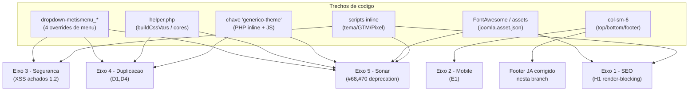
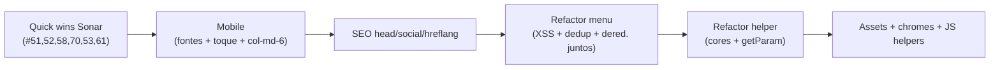

# Pendências cruzadas — onde um eixo encontra o outro

> Vários achados incidem no **mesmo trecho de código** por motivos diferentes. Corrigir esses
> pontos resolve mais de um eixo de uma vez — são os de **maior retorno por mudança**.
> Use este documento para agrupar o trabalho e evitar tocar o mesmo arquivo duas vezes.

## Mapa de convergência

## Pontos de alto retorno

### 1. Overrides `dropdown-metismenu_*` — **3 eixos**
| Eixo | Achado | O que fazer no mesmo lugar |
|------|--------|----------------------------|
| Segurança (3) | #1, #2 — XSS via `menu_icon`/`anchor_css`/`anchor_title`/`title` | escapar com `ENT_QUOTES` |
| Duplicação (4) | D1, D4 — bloco `$linktype` ×4; `heading`≈`separator` | extrair `genericoMenuLinkType()` |
| Sonar (5) | #68 (S4144), #70 (`: null` → deprecation PHP 8.1), #71 (onclick inline) | dedup + `: ''` + sanitizar `window_open` |

> **Ação única:** criar o helper de menu compartilhado **já com o escape embutido** e trocar
> `: null` por `: ''`. Resolve XSS + duplicação + deprecation + complexidade de uma vez.
> Lembrar: arquivo `.php` novo precisa entrar em `templateDetails.xml <files>`.

### 2. `helper.php` / cores — **2 eixos**
| Eixo | Achado | Ação |
|------|--------|------|
| Duplicação (4) | B1, B2 — defaults lidos 2–4×; ~40 linhas de concatenação | constantes + `colorVars()` + ler cada cor 1× |
| Sonar (5) | #13 (Critical S1192), #14, #12 (método longo) | mesmas constantes resolvem o S1192 |

### 3. `col-sm-6` em `top-*`/`bottom-*` — **mobile, com precedente**
O **footer já foi corrigido nesta branch** (`col-12 col-md-6`, commit `183c873`). Os blocos
`top-a/top-b` e `bottom-a/bottom-b` (`index.php:291-292,315-316`) ficaram com o padrão antigo.
**Ação:** replicar exatamente a mesma troca — consistência + corrige o achado E1 do Eixo 2.

### 4. Chave `'generico-theme'` (PHP inline + JS) — **2 eixos**
Duplicação (A10) + Sonar (#81 drift). **Ação:** expor a chave via `data-*` no `<html>`/`<body>`
a partir do PHP e ler no JS — elimina a string duplicada e o risco de dessincronização.

### 5. Assets (`joomla.asset.json`) — **2 eixos + pendência do `CLAUDE.md`**
SEO (H1: FontAwesome render-blocking) + Sonar (#37: asset `offline` inexistente) + a
inconsistência conhecida `media/` vs URIs. **Ação:** higienizar o `joomla.asset.json`
(FontAwesome enxuto/subset, `offline.css` real, URIs corretas) num lote só.

### 6. Scripts inline (tema/GTM/Pixel) — **3 eixos**
Segurança (#12 CSP) + Sonar (#82 não-lintável) + SEO (H5 caminho crítico). **Ação:** documentar
o trade-off de CSP/nonce e, onde compensar, mover para `.js` com `data-*`. Baixa prioridade
(mover o script de tema reintroduz flash de tema) — decisão a registrar.

## Ordem recomendada (respeitando dependências)

1. **Quick wins** isolados (não tocam estrutura).
2. **Mobile** (queixa do usuário; alto impacto, baixo risco).
3. **SEO** (head/social/hreflang).
4. **Menu** (junta Segurança 1/2 + Duplicação D1/D4 + Sonar #68/#70).
5. **Helper** (Duplicação B1/B2 + Sonar #13/#14).
6. **Assets + chromes + helpers JS** (Sonar #37/#48 + Duplicação E/C).

> Cada lote é empacotável e testável separadamente. Atualizar fixtures Playwright ao mexer em
> CSS/overrides. Versão final em produção:
> `https://apps.sobieskiproducoes.com.br/tpl_generico/atualizacao.xml`.
