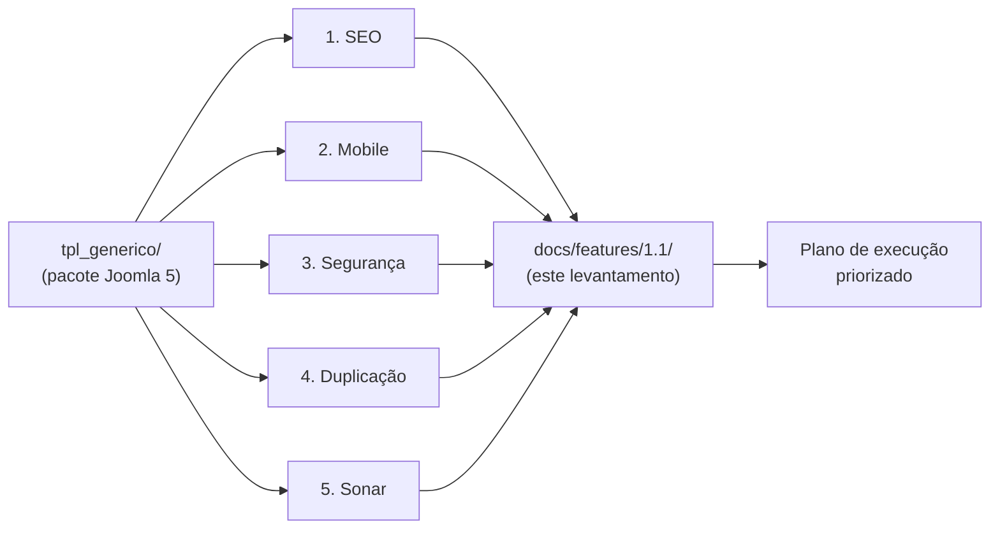
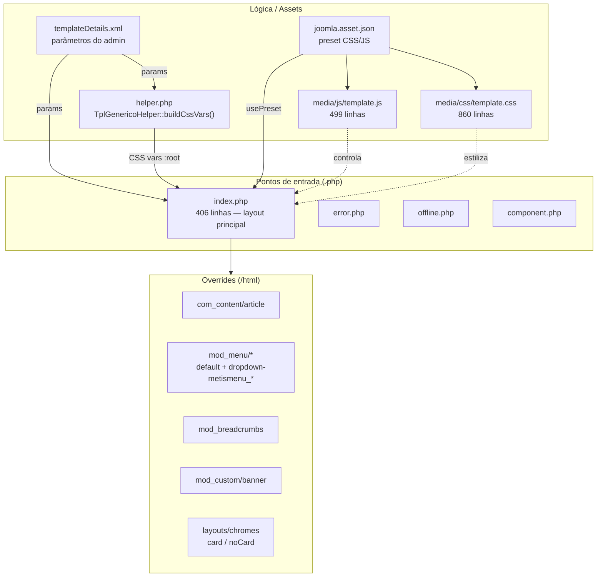
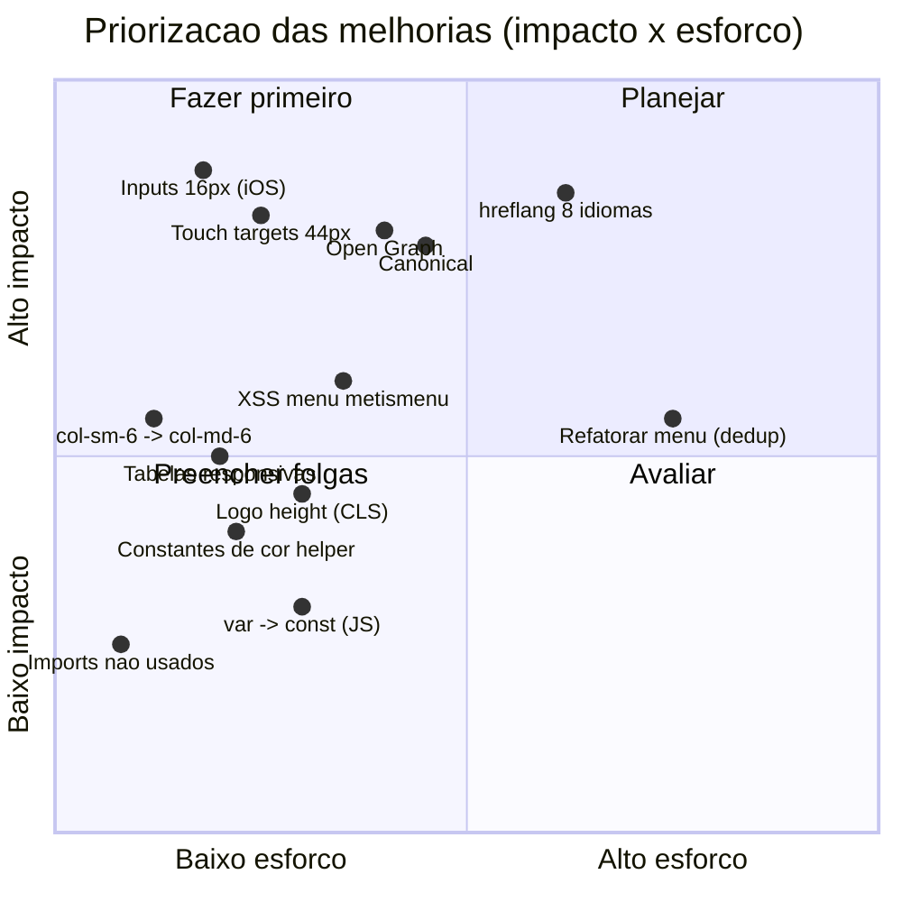

# Feature 1.1 — Levantamento de melhorias do `tpl_generico`

> **Status:** Levantamento (análise read-only). Nenhum arquivo do template foi alterado.
> **Data:** 2026-06-19
> **Branch de referência:** `feature/melhorias`
> **Escopo analisado:** `tpl_generico/` (~3.760 linhas: PHP, CSS, JS, XML, JSON)

Este diretório consolida o levantamento técnico solicitado, dividido em **5 eixos**. Cada
eixo tem um documento próprio com achados detalhados (`arquivo:linha`, severidade,
problema e recomendação concreta). Este `README` é o índice + visão executiva.

## Documentos

| # | Eixo | Documento | Achados | Severidade dominante |
|---|------|-----------|--------:|----------------------|
| 1 | SEO | [`01-seo.md`](01-seo.md) | 28 | 3 Altas (canonical, Open Graph, hreflang) |
| 2 | Responsividade mobile | [`02-responsividade-mobile.md`](02-responsividade-mobile.md) | 30+ | Foco "tudo fica pequeno no celular" |
| 3 | Segurança | [`03-seguranca.md`](03-seguranca.md) | 15 | 0 Crítica/Alta; principal = XSS herdado no menu |
| 4 | Redução de código duplicado | [`04-codigo-duplicado.md`](04-codigo-duplicado.md) | 40+ | Constantes + métodos no `TplGenericoHelper` |
| 5 | Issues SonarQube/PHPMD/ESLint | [`05-issues-sonar.md`](05-issues-sonar.md) | 84 | 3 Critical, ~14 Major |
| ↔ | Pendências cruzadas (convergência entre eixos) | [`06-pendencias-cruzadas.md`](06-pendencias-cruzadas.md) | 6 pontos | Maior retorno por mudança |

## Metodologia

O levantamento foi feito por **5 análises paralelas independentes** (uma por eixo),
cada uma varrendo os arquivos relevantes do pacote e produzindo achados rastreáveis.
A síntese cruza os achados — vários problemas aparecem em mais de um eixo (ex.: o bloco
de menu `dropdown-metismenu_*` é simultaneamente **duplicação**, **issue Sonar** e
**XSS de segurança**), o que indica os pontos de maior retorno.



## Arquitetura do template (contexto)

Mapa de como o pacote se organiza — base para entender onde cada achado incide.



## Resumo executivo por eixo

### 1. SEO — lacunas em metadados sociais, canônicos e multilíngue
O template já acerta o básico (viewport em todas as páginas, `preconnect` para Google
Fonts e tracking, logo com `fetchpriority="high"`, skip-link, JSON-LD de Article e
Breadcrumb, `lang`/`dir` no root). As **3 lacunas Altas**:
- **Sem `rel="canonical"`** → risco de conteúdo duplicado.
- **Sem Open Graph / Twitter Cards** — mesmo com o Facebook Pixel ativo, compartilhamentos saem sem card.
- **Sem `hreflang`/`alternate`** num site declaradamente de **8 idiomas** → idioma errado nos SERPs.

Médias relevantes: `Organization`/`WebSite` JSON-LD ausentes, `role="banner"` duplicado,
logo sem `height` (CLS), banner como `background-image` (piora LCP), FontAwesome completo render-blocking.

### 2. Responsividade mobile — "muita coisa fica pequena"
Causa-raiz da queixa do usuário, mapeada em achados concretos:
- **Inputs sem `font-size: 16px` no mobile** → o iOS dá **zoom automático** ao focar (sensação de layout quebrado).
- **Sem piso de 16px no corpo** e o "bump" de fonte só vale abaixo de 576px → celular grande/paisagem fica no tamanho desktop cru.
- **Touch targets abaixo de 44px**: fechar modal (36px), theme-toggle (40px), itens de menu, bottom-nav (fonte 0.7rem ≈ 11px).
- `col-sm-6` em `top-*`/`bottom-*` quebra em 2 colunas já em 576px (mesmo defeito que o footer **já corrigido** nesta branch).
- Tabelas de artigo sem scroll horizontal → estouram a largura. Banner (`.banner-overlay`/`.overlay`) **sem CSS** no pacote.

### 3. Segurança — perfil de risco baixo
- **Sem SQL Injection**: o template não faz nenhuma query direta (confirmado).
- `_JEXEC` presente em 100% dos `.php`. JS client-side limpo (sem `innerHTML`/`eval`/`document.write`).
- **Único vetor explorável por usuário de menor privilégio**: XSS armazenado nos overrides `dropdown-metismenu_*` (`menu_icon`, `anchor_css`, `anchor_title`, `title` ecoados sem escape) — herança do core Cassiopeia, mas o próprio `mod_menu/default.php` já escapa corretamente, então é incoerência a corrigir.
- O restante (`customHeadCode`, GTM/Pixel, fontes, favicons, textos de cookie/newsletter) é **super-admin-only = risco aceito**, já documentado. Recomendações são endurecimento opcional + padronizar `ENT_QUOTES` e documentar incompatibilidade com CSP estrita.

### 4. Redução de código duplicado — constantes e métodos
Maiores clusters:
- **`helper.php`**: defaults de cor lidos 2–4× cada (`#1F4E79`, `#2F80ED`...) e ~40 linhas de concatenação `$cssVars .= "--x: y;"`.
- **`index.php`**: `countModules()` chamado ~24× (6 posições contadas 2×); blocos `if (countModules) { div.container > jdoc }` repetidos; cadeias de classe de grid e header.
- **`html/mod_menu/dropdown-metismenu_*`**: ~20 linhas duplicadas em 4 arquivos; `heading.php` e `separator.php` quase 100% iguais.
- **`template.js`**: padrões `byId`+early-return, throttle de scroll, reveal/hide de overlay (3×), wrapper de `localStorage`.
- **`chromes/card.php` vs `noCard.php`**: setup quase idêntico.

### 5. Issues Sonar — 84 achados
3 Critical (literais de cor ≥4× no `helper.php`; hotspots de saída crua; `href` de breadcrumb não escapado), ~14 Major (complexidade cognitiva de `buildCssVars`/`renderMenuItems`/`initNewsletterModal`, duplicações, funções globais no menu, `.= null` com **deprecation no PHP 8.1+**, asset `offline` inexistente). **Quick wins**: remover imports/variáveis não usados, `: null` → `: ''`, escapar `$item->link`, `in_array(..., true)` + `===`, constantes de cor.

## Matriz de priorização (impacto × esforço)



## Roadmap sugerido de execução

Ordenado para entregar valor cedo e isolar mudanças de maior risco. Cada fase é um lote
empacotável/testável (responsividade desktop/tablet/mobile + regressão antes de versionar).

```mermaid
gantt
    title Roadmap de execucao (sugestao)
    dateFormat YYYY-MM-DD
    axisFormat %d/%m

    section Fase 1 - Quick wins
    Imports/vars nao usados, : null, ENT_QUOTES   :f1a, 2026-06-23, 2d
    Escapar href breadcrumb + menu metismenu (XSS) :f1b, after f1a, 2d

    section Fase 2 - Mobile (queixa central)
    Inputs 16px + piso de fonte no corpo          :f2a, after f1b, 2d
    Touch targets 44px (modal, toggle, bottom-nav) :f2b, after f2a, 2d
    col-sm-6 -> col-md-6 + tabelas/banner CSS      :f2c, after f2b, 2d

    section Fase 3 - SEO
    Canonical + meta description fallback + robots :f3a, after f2c, 2d
    Open Graph + Twitter Cards + theme-color       :f3b, after f3a, 2d
    hreflang multilingue + Organization/WebSite    :f3c, after f3b, 3d

    section Fase 4 - Qualidade interna
    Constantes + getParam no helper (dedup cores)  :f4a, after f3c, 2d
    Helpers de modulo/grid no index.php            :f4b, after f4a, 2d
    Refatorar overrides de menu (dedup)            :f4c, after f4b, 3d
    Helpers JS + var->const + magic numbers        :f4d, after f4c, 2d
```

## Restrições do projeto (válidas para a execução)

> Estas regras vêm do `CLAUDE.md` e valem para qualquer implementação posterior:

- **Toda correção é dentro de `tpl_generico/`** e entregue via **pacote ZIP instalável** — nunca editando arquivo solto em produção.
- **`templateDetails.xml` `<files>` deve listar TODO `.php` novo.** Se um eixo criar um helper novo (ex.: `menu-helper.php`), declarar em `<files>`; se criar CSS/JS, registrar no `joomla.asset.json`.
- **Sem `git commit`/`push`/tag sem pedido explícito.** Tag `v*` dispara deploy de produção.
- **Pendência conhecida de assets** (`media/` no manifesto vs URIs do `joomla.asset.json`) afeta o eixo SEO (FontAwesome/`offline.css`) e o cache-busting — ver `04`/`05`.
- **Testes de UI (Playwright)** ficam em `tests/` na raiz; ao mexer em CSS/overrides, atualizar a fixture/spec correspondente.

## Como ler os documentos

Cada documento de eixo segue o mesmo formato:
1. **Resumo + diagrama** (mermaid) do eixo.
2. **Tabela de achados** priorizada.
3. **Achados detalhados**: `arquivo:linha`, severidade, problema, recomendação (com exemplo de código).
4. **Plano de ação** do eixo.

Os achados marcados **"risco aceito"** (segurança) ou **"informativo/conforme"** são
listados por completude, mas não exigem ação.
